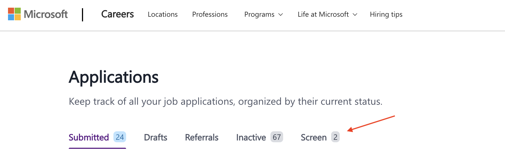

# Microsoft careers page - Application on Screen filter

&nbsp; 

Adds a new filter for applications on Screen status to the candidate's [Microsoft careers applications page](https://microsoft.eightfold.ai/careers/applications?domain=microsoft.com).

## Installation

The script can be used with the Chrome extension:

- [User JavaScript and CSS](https://chromewebstore.google.com/detail/nbhcbdghjpllgmfilhnhkllmkecfmpld?utm_source=item-share-cb) (version 3.1.2 or above).

### How to set up

- Install the Chrome extension.
- Create a new rule.
- Give it a name, e.g. Microsoft careers application on Screen.
- Add the URL patterns: `https://microsoft.eightfold.ai/careers/applications*,https://apply.careers.microsoft.com/careers/applications*`
- Copy the script from the [addNewScreenFilter.js](addNewScreenFilter.js) file and paste into the rule's code.
- Save it.
- Reload the applications page to see the result.

## Preview

## Limitations

The script only counts applications with status `Screen` in the current page. If there are multiple pages of applications, it won't count from the other pages. The script runs on the local HTML page loaded in the browser, not on the server.

## Author

Carlos E. Torres <<cetorres@cetorres.com>>
